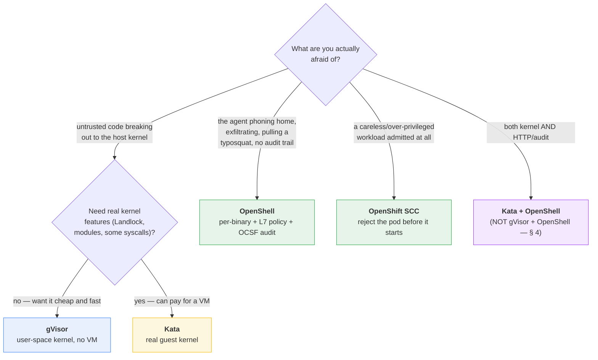

# Which boundary for which threat, at what cost

This is the tutorial's conclusion in one page: given what you are actually afraid
of, which isolation boundary to reach for, what it costs, and when to compose two
of them. Every claim here is measured by a lesson in this repo and read out of its
`report.json` — none is hand-entered. The raw cross-rung matrix that backs it is
[`results/overall.html`](../results/overall.html), rebuilt from every lesson's card
by `infra/report/overall.py`.

For *how* the boundaries work, read
[`isolation-layers.md`](isolation-layers.md) first; this page is only the
decision.

## 1. The boundaries, and the column each one owns

The tutorial's spine is one workload run under progressively stronger isolation.
The finding it exists to produce is that the strong boundaries are strong in
**disjoint** columns — so "stronger" is the wrong axis; "which threat" is the
right one.

| Boundary | Mechanism | Owns the column of… | Does **not** help with |
| :-- | :-- | :-- | :-- |
| **container** (runc) | namespaces + cgroups, host kernel | process / filesystem isolation, resource limits | the host kernel, HTTP-level abuse, audit |
| **gVisor** | user-space kernel (`runsc`) | host-kernel attack surface (syscalls, `/sys/module`, `bpf`) | which binary / method / host an agent talks to; audit; and it **drops Landlock** |
| **Kata** | per-pod lightweight VM, own guest kernel | host-kernel attack surface, *keeping* kernel features gVisor drops (Landlock) | the same HTTP/audit column gVisor misses; costs a VM per pod |
| **OpenShell** | per-binary + L7 policy on ordinary runc | *which* binary, *which* HTTP method, and an **audit trail** | the host kernel — it is not a kernel boundary at all |

The two rows that matter most are gVisor and OpenShell: they never overlap. gVisor
shrinks the kernel and has no opinion about HTTP; OpenShell governs HTTP and
binaries and leaves the host kernel fully exposed. That is what makes composing
them tempting — and § 4 is what happens when you do.

## 2. Start from the threat

## 3. What it costs

| You pick | You get | You pay | Measured in |
| :-- | :-- | :-- | :-- |
| **container** | process + filesystem isolation, resource caps | host kernel fully exposed; no HTTP/audit | lessons 1.2.1, 1.3.1 |
| **gVisor** | tiny host-kernel attack surface | some syscalls simply do not exist; **no Landlock** | lessons 1.2.2, 1.3.2 |
| **Kata** | a real, separate kernel; keeps Landlock | a VM per pod — boot time and memory | lessons 1.2.3, 1.3.3, 1.4.3 |
| **OpenShell** | *which binary*, *which method*, an audit trail | host kernel fully exposed; alpha software, pin it | lessons 1.2.4, 1.3.4, 1.4.4 |
| **OpenShift SCC** | the cluster refuses an over-privileged pod | you must design to the policy, not around it | lesson 1.4.2 |

The cost that surprises people is **not** the VM: lesson 1.3.3 measured Kata's per-pod
VM boot and found scheduling swamped it. The real cost of Kata is operational (a
VM per pod to run and size), and the real cost of OpenShell is that it is **alpha**
— every lesson that uses it pins the version and records it, because unpinned alpha
tooling rots silently.

## 4. Composing two boundaries — and when it bites

Because OpenShell is a different *layer*, not a stronger *runtime*, you can stack
it on gVisor or Kata. The tutorial runs all three real cases rather than asserting
them:

| Composition | Lesson | Result | Why |
| :-- | :-- | :-- | :-- |
| OpenShell **over gVisor** | [1.3.5](../tutorial/phase1-attacks/chapter-3-kubernetes/lesson-05-compose-gvisor-openshell/) (k3s) | Landlock **silently lost** — audit-trail-only | gVisor answers `ENOSYS` to `landlock()` |
| OpenShell **over Kata** | [1.3.6](../tutorial/phase1-attacks/chapter-3-kubernetes/lesson-06-compose-kata-openshell/) (k3s) | fully enforced | the guest kernel ships Landlock |
| OpenShell **over Kata** | [1.4.6](../tutorial/phase1-attacks/chapter-4-openshift/lesson-06-compose-kata-openshell/) (OpenShift) | fully enforced, through SCC admission | the operator's Kata guest ships Landlock; the enterprise path |

> [!danger]
> **The rule:** *composition fails when the lower layer removes a kernel feature
> the upper layer depends on* — and it can fail **invisibly**.
>
> Measured on OpenShell 0.0.99, the gVisor case (lesson 1.3.5) is subtler than the
> folklore. Landlock does drop out, but OpenShell's kubernetes driver *also* backs
> the read-only paths with a **read-only root filesystem**, so `fs_policy_write`
> stays blocked and the scored result is **identical** to the safe Kata stack. The
> only witness that a defense layer vanished is a HIGH *"Landlock Filesystem
> Sandbox Unavailable"* line in the audit trail. **Do not infer that both layers
> are enforcing from the fact that the attack was blocked, or that both are
> installed.** Verify — read the audit trail, or set
> `landlock.compatibility: hard_requirement` so a missing feature makes the sandbox
> fail *closed* instead of running degraded.

Chapter 2 and OpenShift cannot host the gVisor composition (rootless podman cannot
drive `runsc`; gVisor is not a supported OpenShift runtime) — lessons 1.2.5, 1.2.6 and 1.4.5
document why, and point back at the chapter where each composition runs for real.

## 5. The short version

- **Untrusted code, host-kernel escape, cheap:** gVisor.
- **…and you need real kernel features, or hardware-backed isolation:** Kata.
- **Agent exfiltration / typosquats / "what did it try":** OpenShell (L7 + audit).
- **Stop a bad workload before it runs:** OpenShift SCC.
- **You need the kernel column *and* the HTTP/audit column:** compose OpenShell
  over **Kata**, not gVisor — and verify the lower layer did not silently take a
  feature the policy depends on.

The cross-rung numbers behind every line above:
[`results/overall.html`](../results/overall.html).
