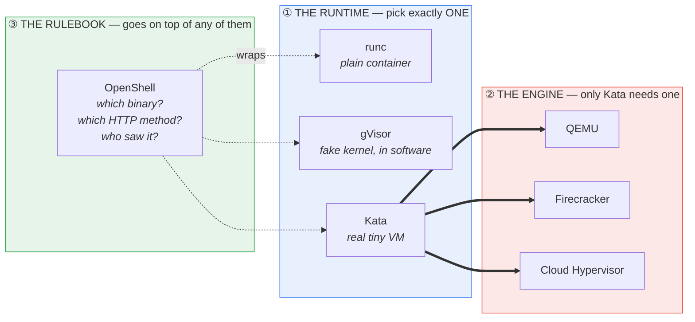
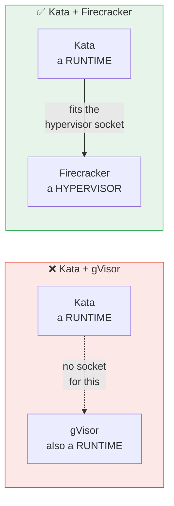
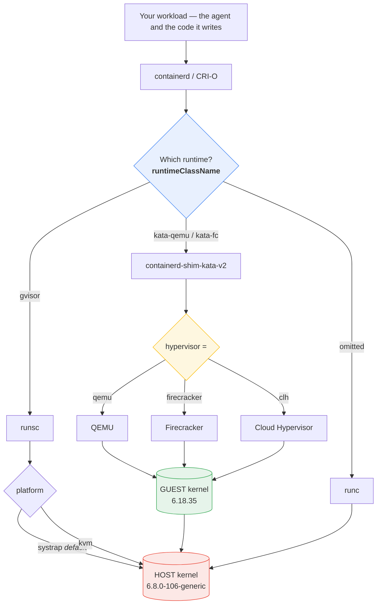
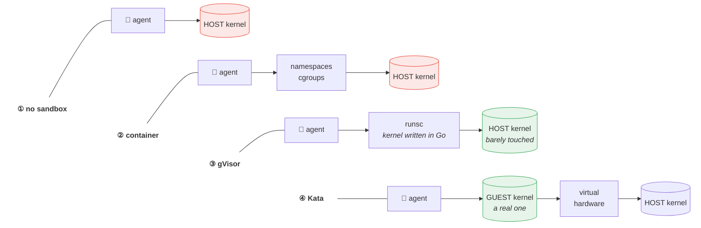
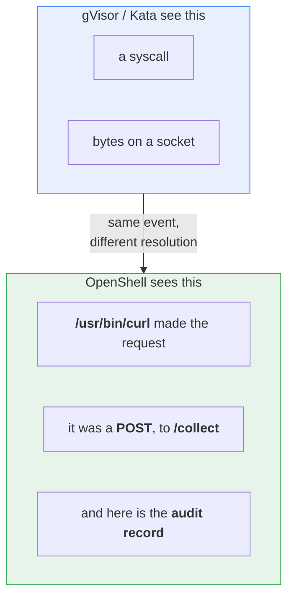
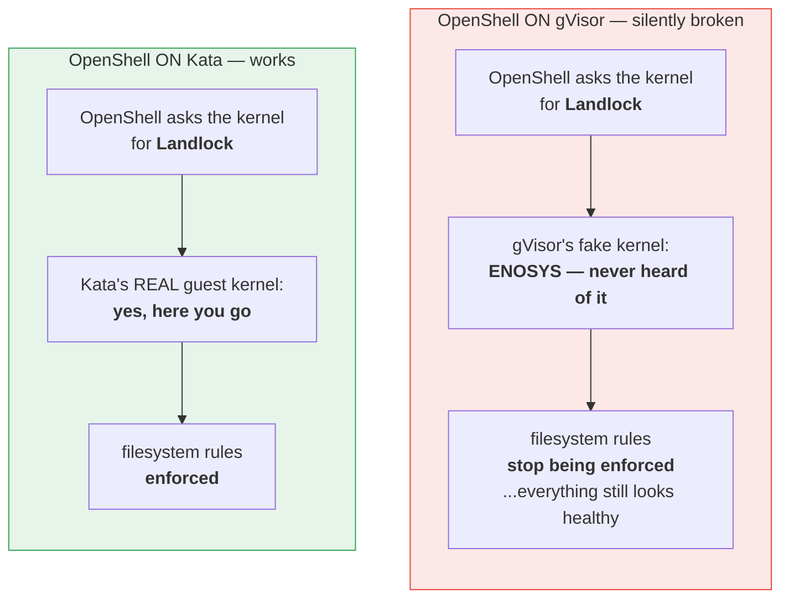
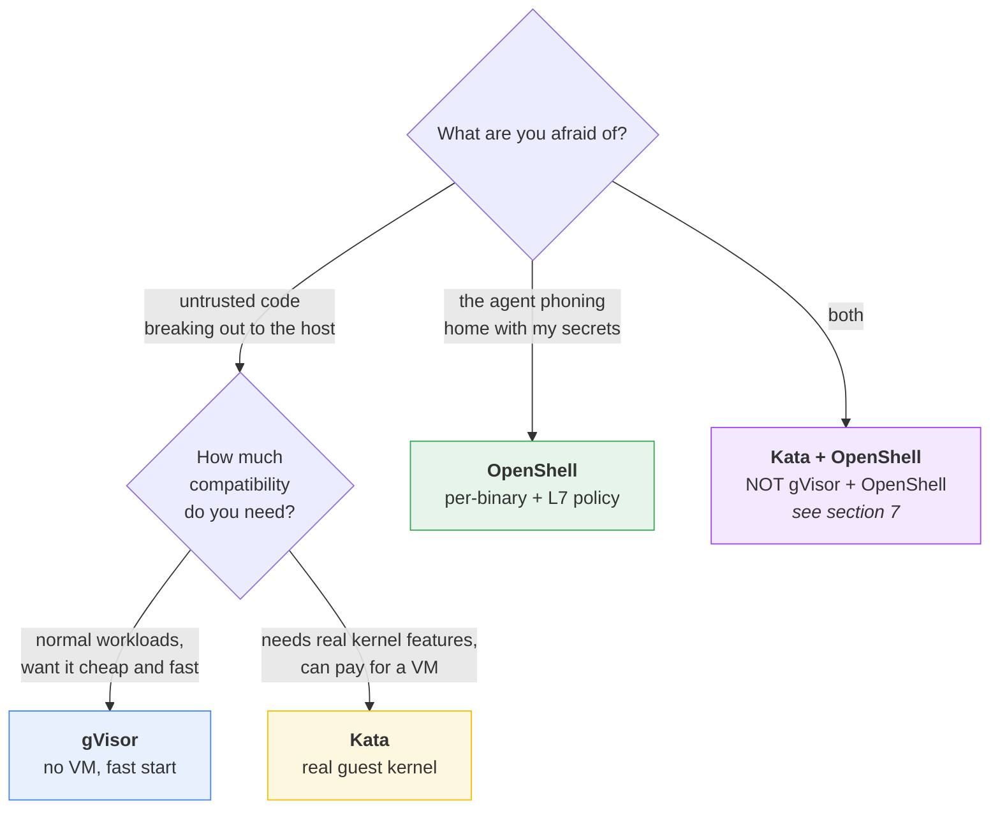

# gVisor, Kata, Firecracker, OpenShell — how they fit together

> [!tip]
> **The one thing to take away:** these four are **not four competing products**.
> They sit at **three different layers**. Two of them are alternatives to each
> other; one lives *underneath*; one lives *beside*.

---

## 1. The whole idea in one picture



**Read it as:** you choose *one* box from Layer 1. If you chose Kata, you also
choose *one* box from Layer 2. OpenShell is not in that choice at all — it goes
on top of whatever you picked.

---

## 2. The two questions everyone asks

| Question | Answer | Why |
| :-- | :-- | :-- |
| Can **Kata** run **Firecracker**? | ✅ **Yes** | Firecracker is a *hypervisor*. Kata needs one. It slots straight in: `hypervisor = firecracker` |
| Can **Kata** run **gVisor**? | ❌ **No** | gVisor is a *runtime*, the same kind of thing Kata is. They are rivals, not partners |

### The plug-socket way to see it



An analogy that holds up: **Kata and gVisor are both *cars*. Firecracker is an
*engine*.** You can put an engine in a car. You cannot put a car in a car.

---

## 3. The full stack, top to bottom



Notice the **symmetry**: gVisor has a pluggable slot at the bottom too — its
*platform*. That slot is structurally the same idea as Kata's *hypervisor* slot.
This is the cleanest way to remember why Firecracker fits under Kata and gVisor
does not: Firecracker is the kind of thing that goes in the bottom slot.

---

## 4. What actually stands between the attacker and your kernel



**The chain gets longer at every rung** — that is the whole ladder in one glance.

**In words a beginner can keep:**

- **Container** — same kernel as the host, just with blinkers on.
- **gVisor** — the workload talks to a *pretend* kernel written in Go. The real
  kernel hears almost nothing.
- **Kata** — the workload gets a *real, separate* kernel inside a tiny VM.
- **OpenShell** — the kernel is fully exposed, but every action is checked
  against a rulebook and written down.

---

## 5. OpenShell is a different axis entirely

The first three all answer the same question: *how much kernel can this thing
touch?* OpenShell answers questions none of them can even hear.



The sharpest demonstration in this tutorial is lesson 5's `binary_scoped` probe:
**the same `curl`, byte for byte, copied to `/tmp`, making the identical
request — denied.** No kernel-level sandbox can see that difference, by
construction. A syscall is a syscall.

---

## 6. What each one actually blocked, measured

Nine attacks, run identically on every rung, on a throwaway Scaleway VM with the
**network on** — because an agent that cannot reach a model API is not an agent.

### Chapter 2 — one host, 13 scored probes

```text
1  no sandbox   ███░░░░░░░░░░   3 / 13
2  container    ███████░░░░░░   7 / 13
3  + gVisor     █████████░░░░   9 / 13   <- kernel attacks die here
4  + Kata       ███████░░░░░░   7 / 13   <- and yet the score DROPS
```

> [!warning]
> **Kata scoring lower than gVisor is not a bug in Kata.** A real guest kernel
> *has* features that gVisor simply does not implement, so probes that gVisor
> refuses with `ENOSYS` genuinely work inside Kata. Stronger isolation, more
> surface. This is the single most counter-intuitive number in the tutorial.

### Chapter 3 — Kubernetes, 19 scored probes

```text
6  k8s hardened  ██████████████░░░░░  14 / 19
7  + gVisor      ████████████████░░░  16 / 19
8  + Kata        ██████████████░░░░░  14 / 19
9  + OpenShell   █████████████████░░  17 / 19
```

> [!important]
> **The two blocks above are not directly comparable.** Chapter 2 scores out of
> **13**, chapter 3 out of **19** — the later suite adds policy and audit rows
> that only exist where a policy engine does. Compare *within* a block, never
> across. `infra/report/overall.py` enforces the same discipline for kernels.

### The four attacks only OpenShell closes

Once the network is on, every kernel boundary loses the same four — and keeps
losing them, no matter how strong it gets:

| Attack | container | + gVisor | + Kata | **+ OpenShell** |
| :-- | :-- | :-- | :-- | :-- |
| exfiltrate credentials | ❌ | ❌ | ❌ | ✅ |
| reach cloud metadata | ❌ | ❌ | ❌ | ✅ |
| install malicious package | ❌ | ❌ | ❌ | ✅ |
| reverse shell | ❌ | ❌ | ❌ | ✅ |
| audit records kept | 0 | 0 | 0 | **20** |

**Kata spends an entire virtual machine per container and closes none of them,**
because the distinction lives in HTTP and a kernel does not read HTTP.

---

## 7. The trap: stacking two boundaries can make you *less* safe

Because OpenShell is a different layer, stacking it on gVisor or Kata is legal.
Lesson 14 runs it rather than describing it, and the result is the most important
lesson in the tutorial.



The failure is **silent** — the attack starts succeeding, and the only signal is
a High-severity *"Running WITHOUT filesystem restrictions"* line in the audit
trail. Setting `landlock.compatibility: hard_requirement` makes it fail *closed*
instead of failing quietly.

> [!danger]
> **The rule that generalizes:**
> *Composition fails when the lower layer removes a kernel feature the upper
> layer depends on.*
>
> Stacking boundaries is not automatically additive. Verify the upper layer is
> still enforcing — do not infer it from the fact that both are installed.

---

## 8. Which one do I actually want?



| You pick | You get | You pay |
| :-- | :-- | :-- |
| **runc** | process + filesystem isolation | host kernel fully exposed |
| **gVisor** | tiny host-kernel attack surface | some syscalls simply do not exist |
| **Kata** | a real, separate kernel | a VM per pod; boot time; memory |
| **OpenShell** | *which binary*, *which method*, *an audit trail* | host kernel fully exposed — it is not a kernel boundary |

---

## More info — for the advanced reader

### Why Firecracker is documented but never demonstrated here

Firecracker is a **VMM**, one layer below an OCI runtime, so it is **never a
`--runtime` value**. It is reachable only as `hypervisor = firecracker` under
Kata, which additionally wants the **devmapper snapshotter** — a storage change
to the node, not a flag. That is a whole substrate for one config line, so this
tutorial documents it and demonstrates `kata-qemu` instead.

`kata-deploy` 4.0.0 on this repo's own cluster registered **25** RuntimeClasses,
`kata-fc` among them. Always read the list rather than guessing a name:

```bash
kubectl get runtimeclass
```

A wrong guess fails as *"RuntimeClass not found"*, which reads like a broken
install rather than a stale assumption.

### Firecracker outside Kata

Firecracker is also used with no OCI runtime above it at all — AWS Lambda and
Fargate are the canonical deployments, and `firecracker-containerd` is the open
path. It is not a container runtime in any of those either. **Kata is simply the
thing that makes Firecracker pod-shaped.**

### Three kernels, one node — proof this is real

Chapter 3 installs `gvisor` and `kata-qemu` on the *same* k3s node, so
`runtimeClassName` is a genuine choice from a menu rather than the only runtime
installed. Read from *inside* each sandbox, the kernel answers differently:

| `runtimeClassName` | `uname -r` from inside |
| :-- | :-- |
| *omitted* | `6.8.0-106-generic` — the node's own |
| `gvisor` | `4.19.0-gvisor` |
| `kata-qemu` | `6.18.35` — a guest kernel |

> [!danger]
> **Always assert the boundary from inside, never from the flag you passed.**
> A workload that *intends* to run under gVisor but silently fell back to `runc`
> exits 0 and prints everything the lesson expects. That is the characteristic
> failure of this whole subject, and it looks exactly like success.

### Why gVisor is absent from the OpenShift chapter

OpenShift's supported sandbox is Kata, via the sandboxed containers operator.
Running gVisor there would mean hand-installing `runsc` onto RHCOS with a
MachineConfig — unsupported by Red Hat. Chapter 4 teaches what OpenShift
actually ships.

### Versions these observations were measured against

| Component | Version | Where |
| :-- | :-- | :-- |
| OpenShell | 0.0.99 — **alpha**, pin it | lessons 5, 9, 13 |
| Kata / `kata-deploy` | 4.0.0 | lessons 4, 8, 12 |
| OpenShift | 4.18.49, single node | chapter 4 |
| Host kernel | 6.8.0-106-generic | Scaleway VM |

---

## Where this came from

Every number on this page was measured by a lesson in this repo and read out of
its `report.json` — none is hand-entered.

- `syllabus.md` — the source of truth for the lesson list and the scoreboard
- `tutorial/lesson-04-container-kata/README.md` — the Firecracker scoping note
- `tutorial/lesson-05-container-openshell/README.md` — the five policy probes
- `ATTACKS.md` — what each of the nine attacks actually does
- `infra/report/overall.py` — builds the cross-lesson matrix from those files
