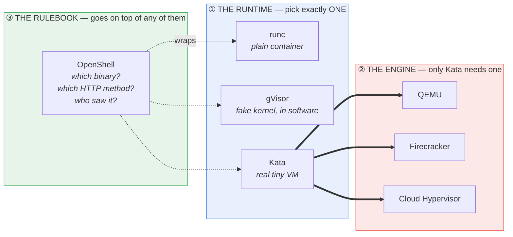
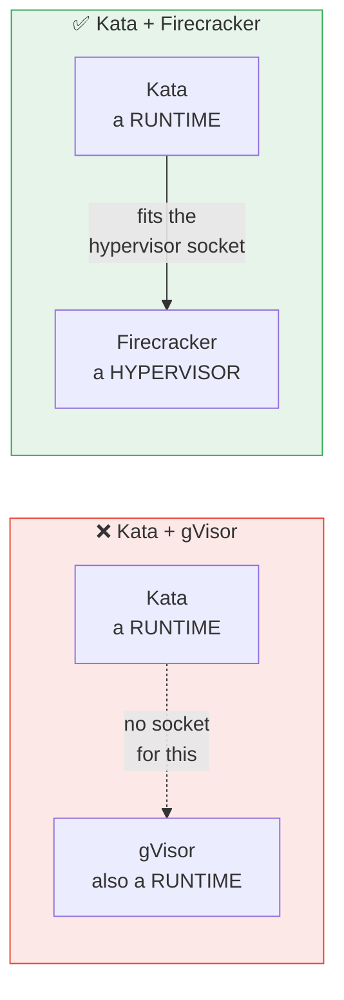
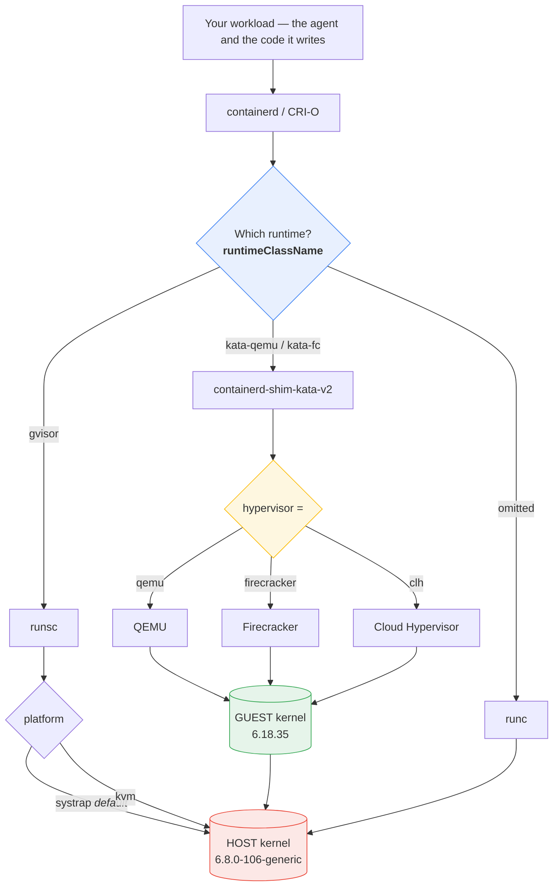
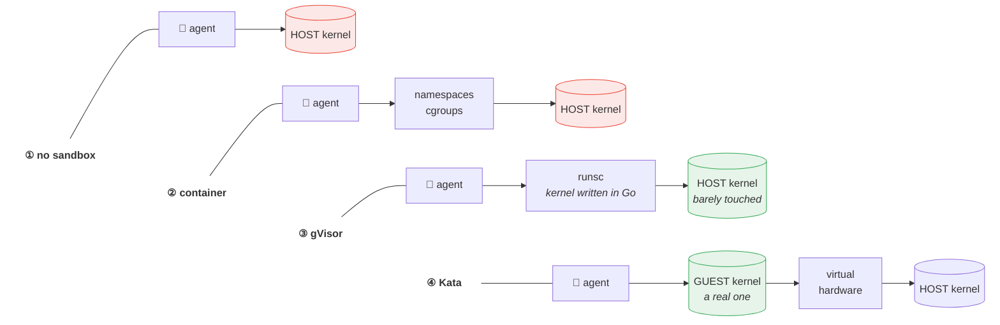
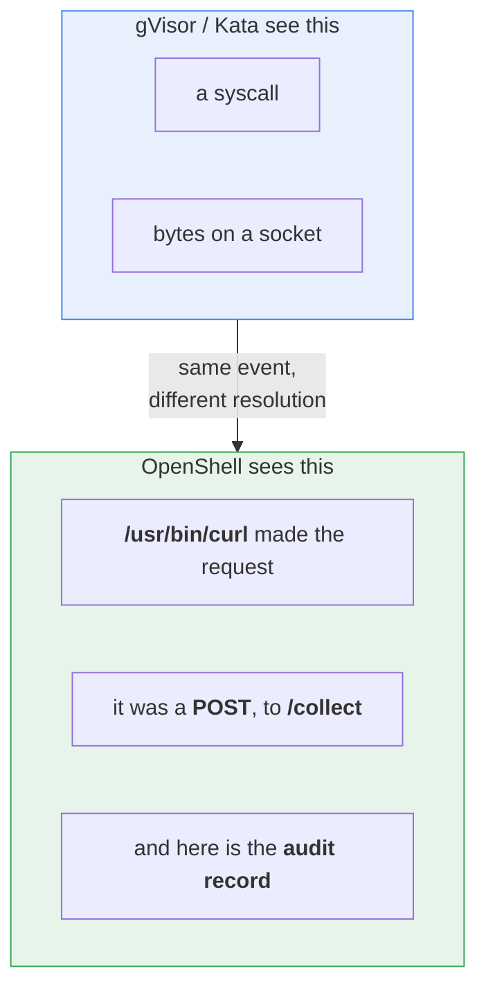
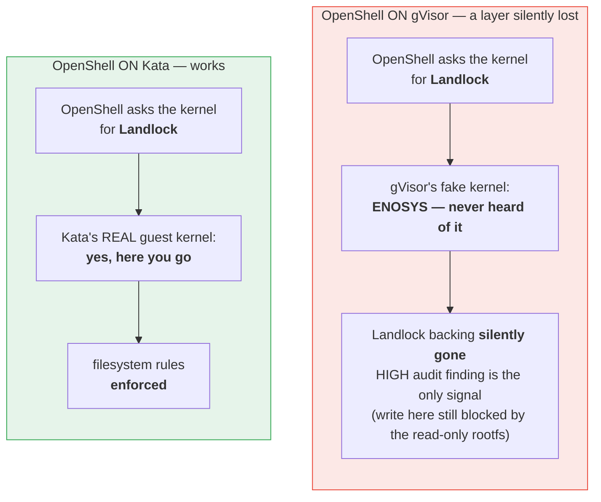
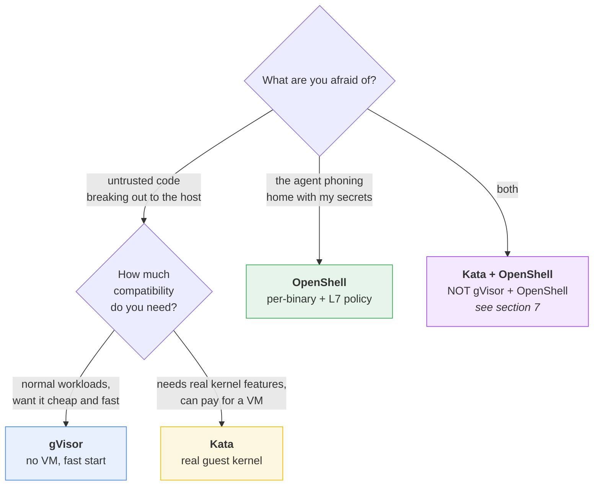

# gVisor, Kata, Firecracker, OpenShell — how they fit together

> [!tip]
> **The one thing to take away:** these four are **not four competing products**.
> They sit at **three different layers**. Two of them are alternatives to each
> other; one lives *underneath*; one lives *beside*.

---

## 1. The whole idea in one picture



**Read it as:** you choose *one* box from Layer 1. If you chose Kata, you also
choose *one* box from Layer 2. OpenShell is not in that choice at all — it goes
on top of whatever you picked.

---

## 2. The two questions everyone asks

| Question | Answer | Why |
| :-- | :-- | :-- |
| Can **Kata** run **Firecracker**? | ✅ **Yes** | Firecracker is a *hypervisor*. Kata needs one. It slots straight in: `hypervisor = firecracker` |
| Can **Kata** run **gVisor**? | ❌ **No** | gVisor is a *runtime*, the same kind of thing Kata is. They are rivals, not partners |

### The plug-socket way to see it



An analogy that holds up: **Kata and gVisor are both *cars*. Firecracker is an
*engine*.** You can put an engine in a car. You cannot put a car in a car.

---

## 3. The full stack, top to bottom



Notice the **symmetry**: gVisor has a pluggable slot at the bottom too — its
*platform*. That slot is structurally the same idea as Kata's *hypervisor* slot.
This is the cleanest way to remember why Firecracker fits under Kata and gVisor
does not: Firecracker is the kind of thing that goes in the bottom slot.

---

## 4. What actually stands between the attacker and your kernel



**The chain gets longer at every rung** — that is the whole ladder in one glance.

**In words a beginner can keep:**

- **Container** — same kernel as the host, just with blinkers on.
- **gVisor** — the workload talks to a *pretend* kernel written in Go. The real
  kernel hears almost nothing.
- **Kata** — the workload gets a *real, separate* kernel inside a tiny VM.
- **OpenShell** — the kernel is fully exposed, but every action is checked
  against a rulebook and written down.

---

## 5. OpenShell is a different axis entirely

The first three all answer the same question: *how much kernel can this thing
touch?* OpenShell answers questions none of them can even hear.



The sharpest demonstration in this tutorial is lesson 5's `binary_scoped` probe:
**the same `curl`, byte for byte, copied to `/tmp`, making the identical
request — denied.** No kernel-level sandbox can see that difference, by
construction. A syscall is a syscall.

> [!note]
> Policy is not the only axis beside the boundary. A third —
> **orchestration**, the control plane that *selects* a runtime and runs the agent (the
> Kubernetes-native `Sandbox` API, `kubernetes-sigs/agent-sandbox`) — is covered in
> [`orchestration.md`](orchestration.md). It provides no isolation of its own, which is
> why it has no scored lesson; naming it keeps the map honest.

---

## 6. What each one actually blocked, measured

Nine attacks, run identically on every rung, on a throwaway Scaleway VM with the
**network on** — because an agent that cannot reach a model API is not an agent.

### Chapter 2 — one host, 13 scored probes

```text
1  no sandbox   ███░░░░░░░░░░   3 / 13
2  container    ███████░░░░░░   7 / 13
3  + gVisor     █████████░░░░   9 / 13   <- kernel attacks die here
4  + Kata       ███████░░░░░░   7 / 13   <- and yet the score DROPS
```

> [!warning]
> **Kata scoring lower than gVisor is not a bug in Kata.** A real guest kernel
> *has* features that gVisor simply does not implement, so probes that gVisor
> refuses with `ENOSYS` genuinely work inside Kata. Stronger isolation, more
> surface. This is the single most counter-intuitive number in the tutorial.

### Chapter 3 — Kubernetes, 19 scored probes

```text
6  k8s hardened  ██████████████░░░░░  14 / 19
7  + gVisor      ████████████████░░░  16 / 19
8  + Kata        ██████████████░░░░░  14 / 19
9  + OpenShell   █████████████████░░  17 / 19
```

> [!important]
> **The two blocks above are not directly comparable.** Chapter 2 scores out of
> **13**, chapter 3 out of **19** — the later suite adds policy and audit rows
> that only exist where a policy engine does. Compare *within* a block, never
> across. `infra/report/overall.py` enforces the same discipline for kernels.

### The four attacks only OpenShell closes

Once the network is on, every kernel boundary loses the same four — and keeps
losing them, no matter how strong it gets:

| Attack | container | + gVisor | + Kata | **+ OpenShell** |
| :-- | :-- | :-- | :-- | :-- |
| exfiltrate credentials | ❌ | ❌ | ❌ | ✅ |
| reach cloud metadata | ❌ | ❌ | ❌ | ✅ |
| install malicious package | ❌ | ❌ | ❌ | ✅ |
| reverse shell | ❌ | ❌ | ❌ | ✅ |
| audit records kept | 0 | 0 | 0 | **20** |

**Kata spends an entire virtual machine per container and closes none of them,**
because the distinction lives in HTTP and a kernel does not read HTTP.

---

## 7. The trap: stacking two boundaries can make you *less* safe

Because OpenShell is a different layer, stacking it on gVisor or Kata is legal.
The composition is run rather than described — **lesson 16** stacks OpenShell on
gVisor (and watches Landlock vanish), **lesson 17** stacks it on Kata (where it
holds), and **lesson 19** proves the Kata case on OpenShift — and the result is the
most important lesson in the tutorial. Chapters 2 and 4 cannot host the gVisor
stack and document why (lessons 14, 18).



The failure is **silent**, and — measured on OpenShell 0.0.99 (lesson 16) — subtler
than "the attack starts succeeding." What actually happens is that Landlock drops
out, flagged only by a High-severity *"Landlock Filesystem Sandbox Unavailable"*
line in the audit trail. The write it guarded stays **blocked anyway**, because
OpenShell's kubernetes driver also backs the read-only paths with a read-only root
filesystem — so the lost layer is *masked*, the scored result is identical to the
safe Kata stack, and the audit finding is the only thing that differs. That is the
more dangerous shape of the bug: a boundary can shed a whole layer with no visible
effect. Setting `landlock.compatibility: hard_requirement` makes it fail *closed*
(the sandbox refuses to start) instead of failing quietly.

> [!danger]
> **The rule that generalizes:**
> *Composition fails when the lower layer removes a kernel feature the upper
> layer depends on* — and it can fail **invisibly**, masked by another layer.
>
> Stacking boundaries is not automatically additive. Verify the upper layer is
> still enforcing — read the audit trail or make it fail closed; do not infer it
> from the fact that both are installed, or from a single probe that still passes.

---

## 8. Which one do I actually want?



| You pick | You get | You pay |
| :-- | :-- | :-- |
| **runc** | process + filesystem isolation | host kernel fully exposed |
| **gVisor** | tiny host-kernel attack surface | some syscalls simply do not exist |
| **Kata** | a real, separate kernel | a VM per pod; boot time; memory |
| **OpenShell** | *which binary*, *which method*, *an audit trail* | host kernel fully exposed — it is not a kernel boundary |

For the full "which boundary for which threat, at what cost" view — including when
two granularities beat two mechanisms stacked at one — see
[`docs/decision-table.md`](decision-table.md).

---

## More info — for the advanced reader

### Firecracker, demonstrated on both Kata rungs

Firecracker is a **VMM**, one layer below an OCI runtime, so it is **never a
`--runtime` value**. It is reachable only as the hypervisor under Kata — the
Layer-2 slot in the picture at the top — and it additionally needs the
**devmapper snapshotter**, because its device model has virtio-block and **no
virtio-fs**, so a container rootfs cannot be shared in and must arrive as a block
device.

Both rungs demonstrate it, and they teach different halves so the tutorial does
not say the same thing twice:

| | Rung | What it teaches |
| :-- | :-- | :-- |
| **Lesson 4** | one host, `nerdctl` | the **mechanism** — one shim binary, a config file that picks the machine, and `--snapshotter devmapper` on the command line |
| **Lesson 8** | Kubernetes | the **selection** — the whole of that collapses into one `runtimeClassName`, chosen from a menu that also holds `gvisor` |

> [!important]
> **Firecracker is not a rung on the ladder, and the lessons prove it rather than
> asserting it.** Both hypervisors sit on KVM and hand the workload the same guest
> kernel, so each lesson runs its entire attack suite a second time under
> Firecracker and diffs the two matrices. **No row moves.** Lesson 4 stays 7/13 and
> lesson 8 stays 14/19. Swapping the VMM does not change your isolation model.

What *does* change is the machine, and it has to be read from inside the guest
because the kernel string is identical under both:

| Reading, from inside | `kata-qemu` | `kata-fc` |
| :-- | :-- | :-- |
| `uname -r` | `6.18.35` | `6.18.35` — no help at all |
| `/sys/bus/pci/devices` | 10–11 | **0** — Firecracker boots `pci=off` |
| `virtio` sits on | `pci0000:00/…` | `virtio-mmio-cmdline/…` |
| rootfs filesystem | `virtiofs` | `ext4` — a block device |
| VMM process on the host | ~262 MB RSS | ~148 MB RSS |
| VMM on disk | 73 MB + 321 MB firmware | **2.9 MB** |

> [!danger]
> **A `containerd-shim-kata-fc-v2` symlink silently runs QEMU.** As of Kata 4.0.0
> the shim does not key its config off its own binary name, and `KATA_CONF_FILE` is
> allow-listed to the two *shipped* config paths. Measured here: the symlink booted
> QEMU under the Firecracker runtime name, reported a convincing guest kernel, and
> exited 0. Only the empty PCI bus caught it. Kubernetes avoids the whole problem
> because kata-deploy passes the path as a containerd runtime option (`ConfigPath`),
> which is CRI-only and therefore unavailable to `nerdctl`.

`kata-deploy` 4.0.0 on this repo's own cluster registers **35** RuntimeClasses,
`kata-fc` among them. Always read the list rather than guessing a name:

```bash
kubectl get runtimeclass
```

A wrong guess fails as *"RuntimeClass not found"*, which reads like a broken
install rather than a stale assumption. And **being in that list is not the same
as working**: `kata-fc` was registered on this cluster from the day Kata was
installed, and a pod naming it failed at sandbox creation with `snapshotter must
be provided to unpack` until the node grew a devmapper thin-pool.

### Firecracker outside Kata

Firecracker is also used with no OCI runtime above it at all — AWS Lambda and
Fargate are the canonical deployments, and `firecracker-containerd` is the open
path. It is not a container runtime in any of those either. **Kata is simply the
thing that makes Firecracker pod-shaped.**

### Three kernels, one node — proof this is real

Chapter 3 installs `gvisor`, `kata-qemu` and `kata-fc` on the *same* k3s node, so
`runtimeClassName` is a genuine choice from a menu rather than the only runtime
installed. Read from *inside* each sandbox, the kernel answers differently:

| `runtimeClassName` | `uname -r` from inside |
| :-- | :-- |
| *omitted* | `6.8.0-106-generic` — the node's own |
| `gvisor` | `4.19.0-gvisor` |
| `kata-qemu` | `6.18.35` — a guest kernel |
| `kata-fc` | `6.18.35` — the *same* guest kernel, on a different machine |

That last row is why the kernel test alone is not enough once there are two
hypervisors: it is the PCI bus, not the kernel, that separates them.

> [!danger]
> **Always assert the boundary from inside, never from the flag you passed.**
> A workload that *intends* to run under gVisor but silently fell back to `runc`
> exits 0 and prints everything the lesson expects. That is the characteristic
> failure of this whole subject, and it looks exactly like success.

### OpenShift gives you exactly one of those three hypervisors

The Layer-2 picture at the top draws three boxes under Kata — QEMU, Firecracker,
Cloud Hypervisor. **OpenShift sandboxed containers ships QEMU and nothing else.**
The operator (v1.12.1) registers a single RuntimeClass, `kata`, and the guest is a
QEMU/KVM VM; there is no Firecracker option in the product to select.

So the hypervisor choice lessons 4 and 8 demonstrate **does not exist in chapter
4** — not because the chapter skips it, but because the platform does not offer
it. That is the same principle as the gVisor note below: chapter 4 teaches what
OpenShift actually ships.

### Why gVisor is absent from the OpenShift chapter

OpenShift's supported sandbox is Kata, via the sandboxed containers operator.
Running gVisor there would mean hand-installing `runsc` onto RHCOS with a
MachineConfig — unsupported by Red Hat. Chapter 4 teaches what OpenShift
actually ships.

### Versions these observations were measured against

| Component | Version | Where |
| :-- | :-- | :-- |
| OpenShell | 0.0.99 — **alpha**, pin it | lessons 5, 9, 13 |
| Kata / `kata-deploy` | 4.0.0 | lessons 4, 8, 12 |
| OpenShift | 4.18.49, single node | chapter 4 |
| Host kernel | 6.8.0-106-generic | Scaleway VM |

---

## Where this came from

Every number on this page was measured by a lesson in this repo and read out of
its `report.json` — none is hand-entered.

- `syllabus.md` — the source of truth for the lesson list and the scoreboard
- `tutorial/chapter-2-one-host/lesson-04-container-kata/README.md` — the QEMU-vs-Firecracker
  measurements, and the shim/config mechanism that selects one
- `tutorial/chapter-2-one-host/lesson-05-container-openshell/README.md` — the five policy probes
- `ATTACKS.md` — what each of the nine attacks actually does
- `infra/report/overall.py` — builds the cross-lesson matrix from those files
