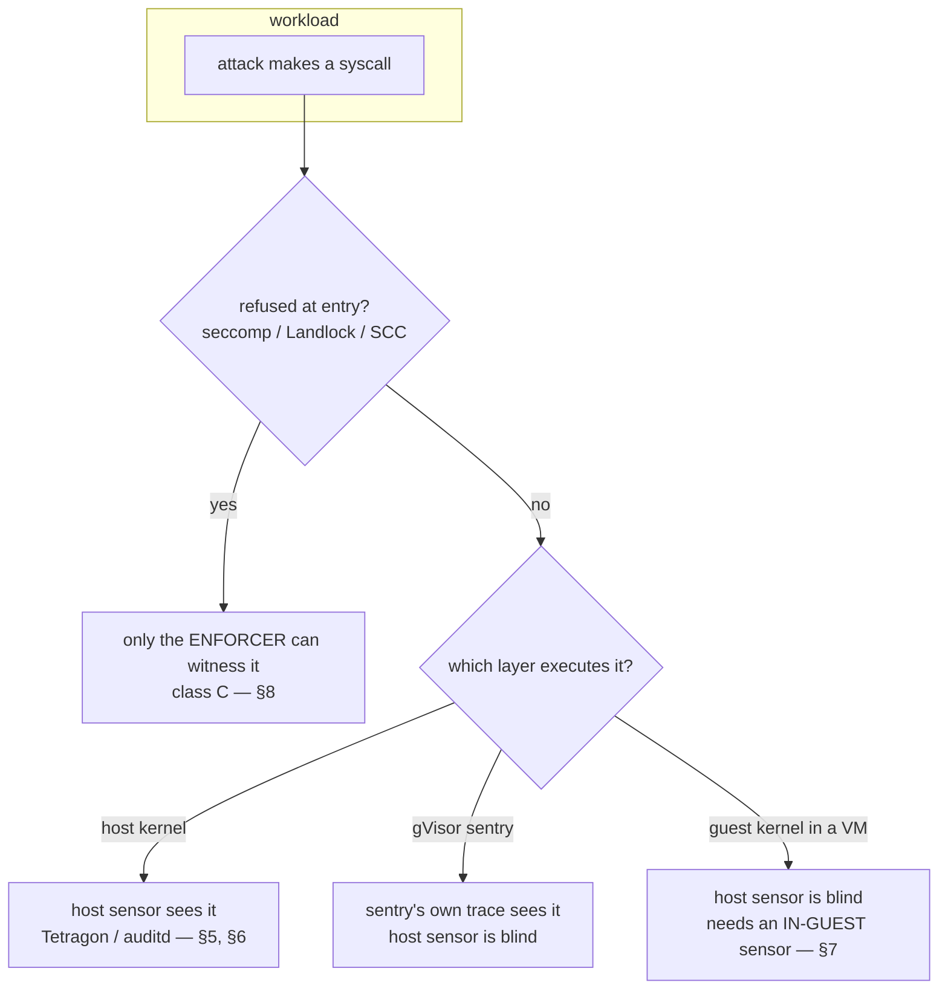

# Spec 06 — Audit-coverage completeness: close the sensor gaps phase 2 left open, and teach the rule that explains the rest

**Status:** ready to implement — **Stage 0 is a correctness fix that must land first; Stages A–B are
mechanical; Stages C–D are discovery-gated**
**Targets:** `infra/substrates/chapter-1-audit/10-auditd.sh`, `infra/substrates/chapter-2-audit/tetragon.sh`, `infra/substrates/chapter-3-audit/tetragon.sh`, every phase-2 leaf's `main.py` (the `PROBE_TAG` map and the per-sensor matchers), `tutorial/phase2-audits/chapter-4-openshift/lesson-01-audit-openshift-pod/nodeaudit.py`, `tutorial/phase2-audits/chapter-2-one-host/lesson-02-audit-container-gvisor/main.py`, `infra/report/render.py` + `overall.py` (the `N_A` recorded state), `infra/images/agent/attacks/suite.py` (kernel_identity evidence), the phase-2 `README.md` set, `ATTACKS.md`, `docs/isolation-layers.md`, `.claude/CLAUDE.md`
**Written:** 2026-08-16
**Depends on:** spec-05 built and committed. This spec changes **no boundary and no phase-1 lesson** —
it changes what the sensors are asked to look at, and it will move phase-2 `recorded` columns. Land it
on a clean tree.

---

## 0. Read this first

Read `.claude/CLAUDE.md` § *at a glance* and spec-05's `current_status.md`, then these six
anchors — each is a place this spec edits and each was confirmed at the location given:

1. `infra/substrates/chapter-2-audit/tetragon.sh:69-128` and `chapter-3-audit/tetragon.sh:113-172` — **the same six kprobes, duplicated on purpose** so the two chapters' sensors cannot drift together. Every policy change in this spec must be made in **both** files, byte-identical, and the "duplicated rather than shared" comment stays.
2. `infra/substrates/chapter-1-audit/10-auditd.sh:20-44` — the six auditd rules, and the comment at `:40-43` that already admits two of the gaps this spec closes.
3. `tutorial/phase2-audits/chapter-4-openshift/lesson-01-audit-openshift-pod/nodeaudit.py:84-91` — `arm()`, which loads **only** `openat,open`.
4. `tutorial/phase2-audits/chapter-2-one-host/lesson-01-audit-container/main.py:59-70` — the `PROBE_TAG` map, copied verbatim into four more leaves (`3-kubernetes/lesson-01:92`, `lesson-02:88`, `lesson-03:96`, `lesson-04:75`, `lesson-06:72`).
5. `tutorial/phase2-audits/chapter-2-one-host/lesson-02-audit-container-gvisor/main.py:142-161` — `state_for()`, whose `return NO_SENSOR` default silently swallows any probe nobody wrote a matcher for.
6. `infra/report/render.py:78-96` — the RECORDED vocabulary and `recorded_of()`.

**Three repo rules that will bite:** never commit (the user commits); never "quickly test" by running
`main.py` on the workstation — it overwrites the card with a laptop stand-in; every re-measured leaf
is a full `./run.sh` on its own box, and the account is verified empty afterwards.

---

## 1. Context — the measured gap

A review of the 15 built phase-2 cards (2026-08-16) counted **232 scored probe rows**, of which
**136 are `LOGGED` — 59%**. The remaining **96 unrecorded cells** were classified against the actual
sensor configuration, not against the prose:

| Class | Cells | Share | What it is |
|:--|--:|--:|:--|
| **A — policy/matcher gap** | 45 | 47% | the sensor is in the right layer and was never told to look |
| **B — sensor below the boundary** | 19 | 20% | host sensor watching a guest; needs an in-guest or network sensor |
| **C — the enforcer is the only witness** | 23 | 24% | refused before any sensor's hook point |
| **D — nothing to record** | 9 | 9% | the attack never happened, or the row is a meta row |

**Class A is the finding, and it is not a subtlety.** Three examples, each verified in the config:

- **`kernel_identity` is unrecorded on 14 of the 15 lessons — every rung that runs it.** It is a plain `uname()`. Chapter 1's auditd has no `-S uname` rule; Tetragon has no kprobe for it; and under gVisor the syscall *is* in the sentry's strace, but `state_for()` has no branch for it and falls through to `return NO_SENSOR` (anchor 5).
- **`/proc/kallsyms` and `/sys/module` — 13 cells.** Both are ordinary file opens. Tetragon's Postfix path list covers the five planted credential files and nothing else; adding three strings covers both probes. `10-auditd.sh:40-43` already writes the gap down and leaves it.
- **Chapter 4's node auditd arms `openat,open` and nothing else** (anchor 3), with no stated reason. Chapter 1 arms `connect`, `execve`, `bpf`, `io_uring_setup` and `perf_event_open` as well. That single omission is most of why 2.4.1 records 4 of 13.

Projected coverage, per lesson, if each class is closed:

| Lesson | now | +A | +A+B |
|:--|--:|--:|--:|
| 2.1.1 host | 85% | **100%** | 100% |
| 2.2.1 container | 54% | 77% | 77% |
| 2.2.2 gVisor | 92% | **100%** | 100% |
| 2.2.3 Kata | 92% | **100%** | 100% |
| 2.2.4 OpenShell | 79% | 89% | 89% |
| 2.3.1 k8s | 42% | 79% | 79% |
| 2.3.2 k8s gVisor | 53% | 89% | 89% |
| 2.3.3 k8s Kata | 63% | 89% | 89% |
| 2.3.4 k8s OpenShell | 58% | 74% | 74% |
| 2.3.5 OpenShell⊕gVisor | 67% | 72% | 72% |
| 2.3.6 OpenShell⊕Kata | 42% | 42% | **74%** |
| 2.4.1 OpenShift pod | 31% | **92%** | 92% |
| 2.4.2 SCC | 100% | 100% | 100% |
| 2.4.3 OpenShift Kata | 0% | 0% | **93%** |
| 2.4.4 OpenShift OpenShell | 63% | 89% | 89% |
| **overall** | **59%** | **78%** | **86%** |

These are what the configuration says *should* become recordable. **Nothing here has been measured** —
every number in this spec is a prediction that the verification in §11 exists to confirm or refute.

### The second problem: the current 59% is flattering

**28 of the 136 `LOGGED` cells mean "a process started", not "we saw the attack."** On every Tetragon
rung and on gVisor, `plant_backdoor`, `malicious_package`, `reverse_shell` and `resource_exhaustion`
all resolve to the single fingerprint `exec` (anchor 4; the gVisor equivalent is
`lesson-02.../main.py:157-158`). If the workload ran anything at all, four attacks score `LOGGED`.
That is a record of Python starting, not of a backdoor being written — and it is the same false
confidence, pointing the other way, that the `NO_SENSOR` wall was built to prevent.

---

## 2. What this is NOT

- **Not a change to any boundary.** No hardening flag, no `RuntimeClass`, no SCC, no OpenShell policy moves. If a `contained` verdict changes, something went wrong — that is a Stage-gate assertion, not an accepted outcome. The one deliberate exception is §7's allow-all NetworkPolicy on 2.4.1/2.4.3, which exists to create an ACL to log against and must be shown not to change a verdict.
- **Not a change to phase 1.** Phase-1 cards are re-run only where Stage 0 proves one is wrong.
- **Not "get every rung to 100%".** §8's class C is real; the deliverable there is a *lesson about why*, and a measured demonstration where the mechanism exists, not a green cell.
- **Not a new leaf.** Every improvement lands in a leaf the syllabus already lists. `syllabus.md` is unchanged by this spec.
- **Not a shared sensor module across leaves.** The `PROBE_TAG` duplication is deliberate per spec-05; it stays duplicated. So does the two-file Tetragon policy.

---

## 3. The rule this spec adds to the tutorial

Phase 2's headline is *"the observability ladder runs backwards to the isolation ladder."* True, but it
under-explains: it reads as a property of the ladder when it is a property of **where you put the
sensor relative to the boundary**. The sharper rule, which every one of the 96 cells obeys:

> **A sensor sees only what passes through the layer it occupies.** A boundary is auditable when the
> sensor sits *at or below* it, and when the action *reaches* the sensor's hook point before anything
> refuses it.

Three consequences the lessons should state in these words:

1. **Sensor above the boundary → blind.** Not a misconfiguration; move the sensor down.
2. **Refused before the hook point → invisible to everyone but the enforcer.** The cheaper and earlier a boundary refuses, the less evidence it leaves. This is the *inverse relationship* worth teaching: gVisor records 92% because its kernel is in user space and observes the call before refusing it; seccomp records nothing because it refuses at the cheapest possible point; **2.4.2 records 100% because its refusal is itself an API request**, which is a log line by construction.
3. **Right layer, wrong question → blind by omission.** 47% of our misses. It is the easiest failure to ship and the hardest to notice, because a `NO_SENSOR` cell looks like a property of the boundary.

**Design principle for the reader, and the line this spec exists to earn:** *prefer boundaries that
are also witnesses.* An enforcement point that cannot describe what it refused buys protection at the
cost of detection, and the tutorial should price that trade explicitly.

---

## 4. Stage 0 — three correctness defects (land first; they change published cards)

These are bugs, not improvements. Two of them currently teach something false.

### 0a. 2.2.2 reads the "node" kernel from **inside** gVisor — the gVisor lesson claims gVisor shares the host kernel

`lesson-02-audit-container-gvisor/main.py:71-78` runs `uname -r` **with `--runtime runsc`**. So
`PROBE_NODE_KERNEL` is `4.19.0-gvisor`, the probe compares gVisor's kernel against gVisor's kernel,
they match, and `kernel_identity` scores `SUCCEEDED / "the SAME kernel as the node"` — the exact
opposite of what gVisor does, on the lesson whose whole subject it is. Compare 2.2.1's
`node_kernel()` (`lesson-01/main.py:115-119`), which is correct: same command, **no** `--runtime`
flag, so it runs under runc on the host.

Second half of the same defect: `main.py:213-218` writes the card's `node_kernel` field from the
*probe's* value rather than the node's, which is why `report.json` records
`node_kernel: 4.19.0-gvisor`.

**Fix:** drop `--runtime runsc` from `node_kernel()`; pass the host value to `card.save()`. Expected
after re-run: `kernel_identity` flips to `BLOCKED`, matching its phase-1 twin 1.2.2 and its k8s
sibling 2.3.2 (which already records the node kernel correctly).

### 0b. 2.4.3's `kernel_identity: SUCCEEDED` is a false positive with no bug behind it

Under OSC, the Kata guest kernel **is** the node's RHEL version, so a version-string comparison
cannot distinguish "in a VM" from "not in a VM". 1.4.3 proves the VM is real
(`kata_dmi_product: KVM`, 6 virtio devices, its own CPU/memory). The row is honest about what it
measured and dishonest about what it implies.

**Fix:** `suite.py`'s `kernel_identity` (around `:620`) must not decide on the release string alone
where stronger evidence is present. Fold the DMI product / virtio-device evidence 1.4.3 already
collects into the verdict, and make the `detail` say *why* — "same version as the node, but DMI
reports KVM: this is a guest kernel that happens to share the node's version". Do **not** simply
flip the verdict; a row that asserts a VM without evidence is the same defect wearing the other hat.

### 0c. Two phase-1/phase-2 twins genuinely disagree, and one of the two runs is wrong

Comparing shared rows across the twins, three cards diverge; 0a explains one. The other two are pod-
spec differences, not sensor differences:

| Row | phase 1 | phase 2 |
|:--|:--|:--|
| `read_credentials` | 1.2.4 `BLOCKED / 0` | 2.2.4 `SUCCEEDED / 5 files` |
| `k8s_sa_token` | 1.3.1 `BLOCKED / absent` (`automountServiceAccountToken: false`) | 2.3.1 `SUCCEEDED / 200`, 1188-byte token |

`CLAUDE.md` claims every built phase-2 leaf is a true audit twin with **zero rows differing**. For
these two that is false. **This spec does not assume which side is correct** — determine it by
reading both pod/container specs, make the twins agree, re-run *both* leaves, and correct
`CLAUDE.md` either way. If the phase-2 spec is the intended one, the phase-1 twin is what changes.

> The other large phase-1/phase-2 row-set differences (2.3.5, 2.3.6, 2.4.3) are **not** defects: those
> phase-1 cards are narrow policy- or Kata-evidence cards and phase 2 runs the full suite. On rows the
> two share, they agree exactly. Do not "fix" them.

---

## 5. Stage A — close the class-A gaps (45 cells, no new sensor)

Same sensors, same boundaries, more rules. This is the cheapest 19 points of coverage in the repo.

### A1. Tetragon: three paths and one syscall

In **both** `chapter-2-audit/tetragon.sh` and `chapter-3-audit/tetragon.sh`, byte-identically:

- Add `/proc/kallsyms`, `/proc/version` and `/sys/module` to the `Postfix` value list on **both** the `sys_open` and `sys_openat` selectors — the two-hook/two-libc reasoning in the existing comment applies unchanged, and dropping one hook re-opens the musl blind spot it documents.
- Add a `sys_uname` kprobe tagged `sbx_probe=kernel_identity`.
- Add a `sys_getdents64` kprobe tagged `sbx_probe=sys_module_count`, **selector-scoped to the `/sys/module` fd**. Unscoped it is a flood — the same backlog risk `10-auditd.sh:23-28` raises `-b 65536` for, and Tetragon has no equivalent safety net. If the fd selector cannot be made to work, prefer the `openat` on `/sys/module` alone and say in the lesson that the *listing* is not separately recorded.
- Bump the `kprobes` count in the substrate's own echo line; `check.sh` reads it.

### A2. Chapter-4 node auditd: arm the rules chapter 1 already arms

In `nodeaudit.py:84-91`, add `execve`, `connect`, `bpf`, `io_uring_setup`, `perf_event_open` and
`uname`, all keyed, all scoped by the same uid range the `openat` rules use. Keep the backlog raise
first and the `lost_count()` guard — with six more rule classes the flood risk goes **up**, and a
non-zero `lost` must continue to invalidate every `NOT_LOGGED`.

Expected: 2.4.1 goes from 4/13 to ~12/13; `exfiltrate`, `cloud_metadata` and `reverse_shell` stop
being `NO_SENSOR`.

### A3. Chapter 1 auditd: the two gaps its own comment names

Add `-S uname -k sbx_uname`. For `/sys/module`, add a `getdents64` rule or accept the `openat`
record and say so — `10-auditd.sh:42-43` currently calls this "an honest gap, and its own small
finding". After this change it is no longer a finding, and that sentence must go rather than rot.

### A4. gVisor: write the matchers the trace already earns

`state_for()` (anchor 5) has branches for eight probes and a `return NO_SENSOR` default. The sentry
traces **every** syscall the app makes, so the default is never the truth — it means "nobody wrote
this branch". Add `kernel_identity` (`E uname(`), and **replace the bare default with a raise or an
explicit `_UNWATCHED` set**, so the next probe added to the suite fails loudly instead of silently
scoring `NO_SENSOR` on the one rung that can see everything. Same treatment in 2.3.2 and 2.3.5.

### A5. The four OpenShell policy probes on rungs that have no OpenShell

`egress_gateway`, `egress_offpolicy`, `http_method_denied` and `binary_scoped` are `NO_SENSOR` on
2.3.1/2.3.2/2.3.3 (12 cells). They are **not** class D: the attacks are attempted and they succeed,
so "an unpoliced HTTP POST happened and nothing recorded it" is a legitimate audit finding. The
`tcp_connect` kprobe already records the connection; what is missing is a matcher tying it to these
probe names. Add it, and let the lesson say the thing that makes the rung interesting: *the connection
is recorded, the fact that it violated a policy is not, because there is no policy engine here to have
an opinion.*

---

## 6. Stage B — retire the shared `exec` fingerprint (28 inflated cells)

Give each of the four exec-tagged attacks a fingerprint of its own. In **both** Tetragon policies:

| Attack | Fingerprint |
|:--|:--|
| `plant_backdoor` | `sys_openat` with `Postfix` on `/.bashrc`, `/.profile`, `/.ssh/authorized_keys` **and** a write-intent flag selector; falls back to the path match alone if the flag selector proves unreliable |
| `reverse_shell` | the existing `tcp_connect`, plus `sys_bind` |
| `resource_exhaustion` | `sys_clone`, selector-scoped or rate-limited — an unscoped clone hook on a fork bomb is a self-inflicted event storm |
| `malicious_package` | `process_exec` **scoped to a `pip`/`python -m pip` argv match**, not "any exec" |

Then split `PROBE_TAG` in all five leaves that carry it, and the gVisor/sentry equivalents in 2.2.2 /
2.3.2 / 2.3.5.

**A cell that regresses from `LOGGED` to `NOT_LOGGED` under this change is a success, not a
failure** — it means the old `LOGGED` was the shared exec event and the specific evidence was never
there. Expect the headline number to *drop* before Stage A's additions bring it back up, and report
both figures side by side rather than only the net.

> `resource_exhaustion` has a second, cheaper witness worth adding beside the clone hook: the kernel's
> own cgroup accounting (`pids.events` `max`, `memory.events` `oom`/`max`). It is a counter rather
> than an event stream, it costs nothing, and it is the only thing that still works when the fork bomb
> outruns the sensor. It is also the honest answer for 2.2.4 and 2.4.4, where the row is currently
> `NO_SENSOR`.

---

## 7. Stage C — put the sensor inside the guest (19 cells) — **discovery-gated**

### C1. 2.3.6 — reuse 2.3.3's sidecar (6 cells); no discovery needed, the mechanism is already built

2.3.6 declines the in-guest sensor in prose, at `main.py:20-21` and `:508-512`, on the grounds that it
needs *"a privileged pod holding the guest's init context."* **That justification was withdrawn by
spec-05's own G1 amendment**: privileged does not get the guest's init context, and the working
mechanism is a **ptrace** tracer enabled by `shareProcessNamespace: true` — which is exactly what
2.3.3 stands up, on the same k3s box, under the same `kata-qemu`.

So the stale reason is doing real damage: it presents a solved problem as a boundary property. Reuse
2.3.3's sidecar in 2.3.6, and rewrite both prose sites. **Gate:** none — but assert the sidecar sees
the workload before trusting a `NOT_LOGGED`, exactly as 2.3.3 does.

### C2. 2.4.3 — the sidecar can already see the workload; it has no tracer (13 cells)

`lesson-03.../main.py:256-277` reports the sidecar *can* see the workload (`shareProcessNamespace`
works; the namespace is shared) and cannot be a sensor: no `strace` in the stock UBI image, `dnf`
blocked by the read-only rootfs and the non-root uid. The two reasons given for not baking one in are
"RHCOS has no podman to build with" and "no `*.apps` route to push a registry through". **Both have
answers that were never considered.** Three candidates, in preference order:

- **G-C2a — build in the cluster.** OpenShift ships an internal registry, and `oc new-build --binary` runs the build **inside** the cluster: no local podman, no external route. *Gate:* confirm the SNO image registry is `Managed` with usable storage, and that a BuildConfig completes and the resulting ImageStream is pullable by the sandbox namespace. Registry storage on SNO is the likely failure point — if it is `Removed`, enabling it mutates cluster config and needs the user's approval before anything else in C2 proceeds.
- **G-C2b — an in-process sensor with no privilege at all.** Python's `sys.addaudithook()` (PEP 578) fires on `open`, `socket.connect`, `os.exec` and `subprocess`, from inside the workload, needing nothing from the platform. It closes most of C2 on its own. **It must be introduced with its own limitation stated in the lesson, or it misteaches**: it is a *demonstration* of where a sensor has to live, not a security control — an attacker who leaves Python (execs a shell, writes via a C extension) leaves the hook behind. Frame it as "the workload can be made to confess", never as "the platform records this".
- **G-C2c — record the network from outside the VM.** The guest's packets still cross the node, so a syscall sensor being blind does not make the *flows* invisible. OpenShift's OVN-Kubernetes ACL audit logging (`k8s.ovn.org/acl-logging` on the Namespace → `/var/log/ovn/acl-audit-log.log`) would record `exfiltrate`, `cloud_metadata` and `reverse_shell` on both 2.4.1 and 2.4.3. *Gate, and it is the sharp one:* **ACLs only exist where a NetworkPolicy exists.** Adding one changes what the phase-1 twin measured. The only acceptable form is an **allow-all** NetworkPolicy logged at `notice`, plus an explicit assertion that **no `contained` verdict moved** — if any does, the option is abandoned, not argued with.

**Each gate is a STOP-and-report.** A gate that fails means 2.4.3 stays partly blind and the lesson
says so with the evidence, which is a legitimate outcome for this chapter — it is the same trade
2.4.3 already names, just measured more precisely.

---

## 8. Stage D — the enforcer as the only witness (23 cells) — **discovery-gated, and this is the new teaching**

Class C is where the user's "we should be able to audit everything" meets a real wall — and the wall
has a door, which the repo currently names in prose and never opens.

### D1. seccomp refuses at syscall entry (15 cells)

`lesson-01-audit-container/main.py:71-85` already establishes the mechanism, measured: podman's
default profile falls to `SCMP_ACT_ERRNO` for `bpf` / `io_uring_setup` / `perf_event_open` under
`--cap-drop ALL`; seccomp is evaluated in `syscall_trace_enter` **before** the `sys_enter`
tracepoint; a filter returning an errno never runs the syscall body, so no kprobe, tracepoint or
auditd exit hook can fire. It names the only possible witness — `SECCOMP_RET_LOG` → auditd
`type=SECCOMP` — and stops there.

Open it. Two routes, and **the difference between them decides whether the lesson is honest**:

- **`SCMP_ACT_LOG` allows the syscall and logs it. It is the wrong answer** — it changes the boundary to buy the record, which is precisely the trade the tutorial exists to make visible rather than to make silently.
- **The right route keeps `SCMP_ACT_ERRNO` and adds the log flag**: `SECCOMP_FILTER_FLAG_LOG` on the loaded filter, plus `errno` present in `/proc/sys/kernel/seccomp/actions_logged`. The behaviour is unchanged; the refusal becomes an audit record.

*Gate G-D1:* the OCI runtime-spec carries a `linux.seccomp.flags` array, and podman's profile format
exposes a top-level `flags` key — **verify that podman 5.x / crun on the chapter-2 box actually
propagates `SECCOMP_FILTER_FLAG_LOG` to the loaded filter, and that a refused `bpf()` produces a
`type=SECCOMP` record**, before writing a word of lesson prose. If it does not propagate,
`SCMP_ACT_NOTIFY` (a userspace supervisor that sees the call and still refuses it) is the fallback;
if neither works, **the finding is that it cannot be done on this stack**, which is worth as much as
a green cell and must be reported as the outcome rather than as a failure to deliver.

### D2. Landlock denials (8 cells)

`fs_policy_write` is `NO_SENSOR` on eight cards. Landlock gained kernel audit support in **Linux
6.15**; these boxes run 6.8 (Ubuntu Noble) and 5.14 (RHCOS), so on these kernels the kernel genuinely
cannot report that a Landlock check failed, and OpenShell's own trail is the only possible witness.

*Gate G-D2:* **verify the 6.15 claim against the kernel source or release notes before it goes into a
lesson** — it is the sort of version fact that is easy to half-remember and expensive to publish
wrong. Then check whether OpenShell's OCSF trail records `fs_policy` decisions at all; if it does,
these cells are class A, not class C, and belong in Stage A.

### D3. The prose that makes this a lesson rather than a limitation

The rule from §3, stated at the top of the phase-2 chapter overview and referenced from each affected
leaf. The three worked examples are already in the repo and only need naming: gVisor at 92% because
it observes before refusing; seccomp at 0% because it refuses at the cheapest point; **2.4.2 at 100%
because its refusal is an API request**, which remains the sharpest finding in phase 2 and is
currently presented as a curiosity rather than as an instance of a rule.

---

## 9. Scoring honesty — separate "we missed it" from "there was nothing to miss"

Nine cells are counted as unrecorded that are not misses: `k8s_sa_token` where the token was never
mounted (4), and the `audit_records` meta row (5). They depress four lessons' coverage for no reason.

Add **`N_A`** to the RECORDED vocabulary in `render.py:78-96`, with its own glyph and legend entry
("nothing happened to record"), excluded from the coverage denominator in both `render.py` and
`overall.py`. Set it where the attack was structurally impossible on that rung.

**Keep the distinction that matters** and surface it in the report: an attack that **succeeded**
unrecorded is a hole; an attack that was **blocked** unrecorded costs you the detection of intent and
reconnaissance but is not a breach. Of today's 96 unrecorded cells only **33 are succeeded-and-
unrecorded** — and of those, 22 are class A, 8 are the two Kata rungs, 3 are class C. `overall.py`
should report that number as a first-class figure, because it is the one a reader should act on.

---

## 10. Prose updates

Rule, not an enumeration: **every `NO_SENSOR` explanation in a phase-2 README is a claim about a
boundary, and after Stages A–C most of them become false.** A cell that flips from `NO_SENSOR` to
`LOGGED` leaves behind a paragraph explaining why it could never have been otherwise.

Named sites that are wrong *today*, before any change:

- `infra/substrates/chapter-1-audit/10-auditd.sh:40-43` — "an honest gap, and its own small finding" (A3 closes it).
- `lesson-01-audit-container/main.py:53-58` — "/proc reads … and uname … have no hook — an honest `NO_SENSOR`, and the shape of a targeted policy vs. auditd's catch-all". Half-true and about to be false: it is the shape of a targeted policy that was pointed at the wrong things, and 2.1.1's catch-all misses `uname` too.
- `chapter-3-kubernetes/lesson-06.../main.py:20-21` and `:508-512` — the withdrawn "privileged pod holding the guest's init context" justification (§7 C1).
- `.claude/CLAUDE.md` § *at a glance* — the "zero rows differ" claim, per §4 0c.

---

## 11. Verification (staged; each stage gates the next)

Every re-measurement is a full `cd tutorial/<phase>/<chapter>/<lesson> && ./run.sh` on the lesson's own
box, output redirected to a file and the file grepped — never the run piped through `grep`. Chapters 2
and 3 are cheaper through `infra/chapter-02.sh` / `chapter-03.sh`.

**Stage 0:**
- [ ] 2.2.2 re-run: `node_kernel` is the node's, `kernel_identity` is `BLOCKED`, and it now agrees with both 1.2.2 and 2.3.2
- [ ] 2.4.3's `kernel_identity` states the DMI evidence in `detail` and no longer implies a shared kernel
- [ ] the 1.2.4/2.2.4 and 1.3.1/2.3.1 twins agree on every shared row, with **both** sides re-run; `CLAUDE.md` corrected to match reality either way

**Stage A:**
- [ ] both Tetragon policies are byte-identical (`diff` the extracted heredocs — a gate, not a habit)
- [ ] every re-run leaf: **no `contained` verdict changed** against its pre-Stage card. This is the whole safety property of Stages A and B
- [ ] `lost=0` on every auditd rung, and the guard still refuses to report when it is not
- [ ] gVisor's `state_for()` raises on an unknown probe rather than defaulting to `NO_SENSOR`
- [ ] measured per-lesson coverage recorded against §1's prediction, **with the misses called out** — a prediction that missed is a finding about the sensor, not a number to quietly restate

**Stage B:**
- [ ] the four attacks have four distinct fingerprints; a run with the workload replaced by `true` records **none** of them (the test that the old `exec` tag would have failed)
- [ ] both figures reported: coverage after the split alone, and after A+B together

**Stage C / D:** each gate passed **before** the leaf is built, and a failed gate reported as blocked
rather than shipped green. For C2c, the allow-all NetworkPolicy is proven not to move any verdict. For
D1, the `type=SECCOMP` record is shown for a refused `bpf()` **and** the errno is shown unchanged.

**Every stage:**
- [ ] `nvim-tools --json --all` adds no findings against the baseline
- [ ] **account verified empty** — `scw instance server list`, `scw block volume list`, `scw instance ip list`, zone `fr-par-1`. `scw instance volume list` cannot see this repo's sbs root volumes
- [ ] `infra/down.sh openshift-sno` when chapter-4 work finishes — €0.263/hr, and nothing else will do it
- [ ] **intermittency rule:** a leaf that fails once and passes on re-run with unchanged code is intermittent, not fixed

---

## 12. Risks

| Risk | Detail | Mitigation |
|:--|:--|:--|
| **A new hook changes a verdict** | a policy that logs can also perturb timing or, with `SCMP_ACT_LOG`, permit | verdict-unchanged assertion in every stage DoD; `SCMP_ACT_LOG` explicitly rejected (§8 D1) |
| **`getdents64` / `clone` hooks flood** | a fork bomb under a clone kprobe is a self-inflicted event storm; drops read as `NOT_LOGGED` | selector-scope or rate-limit both; keep the `lost`/drop guard; prefer the cgroup counter for `resource_exhaustion` |
| **The two Tetragon policies drift** | chapters silently stop being comparable — the exact failure the duplication was chosen to prevent | byte-identical `diff` gate in Stage-A DoD |
| **Coverage drops at Stage B and reads as a regression** | retiring the `exec` tag removes 28 unearned `LOGGED` cells | report both figures; state up front that the drop is the point |
| **`sys.addaudithook()` presented as a control** | it is trivially escaped by leaving Python; a reader could deploy it as a security measure | the limitation ships in the same paragraph as the mechanism, or the option is dropped |
| **OVN ACL logging needs a NetworkPolicy** | adding one changes what the phase-1 twin measured | allow-all policy only, plus a no-verdict-moved assertion; abandon on failure |
| **SNO image registry is `Removed`** | G-C2a's build path does not exist, and enabling it mutates cluster config | gate first, ask the user before enabling; C2b needs no registry at all |
| **The Landlock 6.15 claim is wrong** | a version fact published wrong in teaching material | G-D2 verifies against the source before any prose |
| **Chapter-4 re-runs on the human-owned cluster** | 2.4.1/2.4.3/2.4.4 all need re-measuring; the box bills until torn down | batch every chapter-4 change into one cluster session; teardown is an explicit DoD line |

---

## 13. Interaction with prior specs

- **Depends on spec-05 committed.** This spec does not renumber, move or add a leaf; it changes what the sensors built by spec-05 §7 are asked to observe.
- **Consumes spec-05's G1 amendment.** §7 C1 exists *because* that amendment withdrew the "privileged pod / guest init context" claim and 2.3.6's prose still carries the pre-correction version.
- **Does not touch spec-05's `--enable-k8s-api` finding.** Container-id attribution stays; nothing here needs pod enrichment.
- **`syllabus.md` is unchanged** — no leaf is added, removed or reordered.
- **Open question for the user, and the only one that blocks work:** if G-C2a's gate finds the SNO image registry set to `Removed`, enabling it mutates cluster configuration on the human-owned box. That needs an explicit decision before Stage C2 starts; C2b (`sys.addaudithook`) needs nothing from the platform and can proceed either way.
