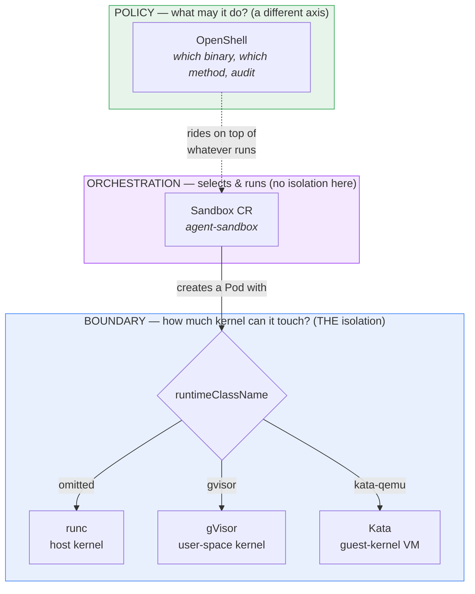

# Agent Sandbox — orchestration, the axis you do not score

> [!tip]
> **The one thing to take away:** Agent Sandbox is **not another sandbox**. It is the
> *control plane* that runs one — it picks your boundary (`runtimeClassName`), starts your
> agent, and manages its lifecycle. **It provides no isolation of its own.** Every attack in
> this tutorial is blocked (or not) by the *runtime* underneath it — gVisor, Kata, plain runc —
> never by Agent Sandbox. That is exactly why it has no scored lesson: there is nothing on the
> attack scoreboard it could move.

This page is a **reference**, not a lesson. The tutorial's chapters measure *boundaries* (how
much kernel the agent can touch) and *policy* (what the agent is allowed to do). Orchestration —
*who selects the boundary, runs the agent, and can it guarantee what it promised?* — is a third,
orthogonal concern. You do not measure it with the nine-attack suite; you measure it by asking
**"did the boundary I declared actually engage?"**

---

## 1. What it is

[`kubernetes-sigs/agent-sandbox`](https://github.com/kubernetes-sigs/agent-sandbox) is a
Kubernetes `Sandbox` **Custom Resource Definition** (`sandboxes.agents.x-k8s.io`) and a
controller, developed under **SIG Apps**. It is the emerging vendor-neutral, Kubernetes-native
API for running exactly the kind of workload this tutorial is about: a long-running, stateful,
single-container agent runtime with a stable identity.

Its own scope note is unusually blunt, and worth quoting because it is the whole point:

> *Agent Sandbox is a **sandbox orchestrator**. It delegates low-level container isolation to
> secure "Sandbox Runtimes" (like gVisor or Kata Containers) by managing Pods configured to use
> these runtimes (via `RuntimeClass`).*

A minimal `Sandbox` is a pod template plus a runtime selector:

```yaml
apiVersion: agents.x-k8s.io/v1beta1
kind: Sandbox
metadata:
  name: my-agent
spec:
  podTemplate:
    spec:
      runtimeClassName: gvisor        # <- the boundary. THIS is where isolation comes from.
      containers:
        - name: agent
          image: <the agent image>
```

---

## 2. Where isolation actually comes from — and where it does not

This is the sentence to keep: **isolation comes from the `runtimeClassName`, never from the
orchestrator.** Agent Sandbox's own threat model says so — *"Agent Sandbox itself does not
implement isolation but supports configuring these runtimes."*



Read it as three **orthogonal** questions, not a stack of increasing safety:

| Axis | Question | Answered by | Measured by |
| :-- | :-- | :-- | :-- |
| **Boundary** | how much kernel can the agent touch? | runc / gVisor / Kata (via `runtimeClassName`) | the nine-attack suite (kernel rows) |
| **Policy** | what is the agent *allowed to do*? | OpenShell (per-binary, L7, audited) | the policy + audit rows |
| **Orchestration** | who selects & runs it, and can it *guarantee* the boundary? | raw Pod → **Agent Sandbox** → OpenShift operator + SCC | *"did the declared boundary engage?"* |

**Agent Sandbox owns the third row and only the third row.** Stack it on gVisor and the
scorecard is a gVisor scorecard; stack it on Kata and it is a Kata scorecard. The orchestrator
adds convenience and lifecycle, not a single blocked attack.

---

## 3. What it adds instead: guarantee and lifecycle

If it blocks nothing, why use it? Because wiring a raw Pod by hand is how you *forget* a
boundary or run it inconsistently at scale. Agent Sandbox is the declarative, standardized way
to run the isolation the rest of this tutorial taught:

| Feature | What it buys the agent | Analogous plain-Kubernetes pain |
| :-- | :-- | :-- |
| Stable identity | a fixed hostname + network identity per sandbox | a bare Pod is cattle; a `StatefulSet` is heavier and numbered |
| Persistent storage | state survives restarts | hand-wired PVCs |
| Lifecycle: pause / resume | idle an agent without destroying it | not a Pod primitive at all |
| `SandboxWarmPool` | pre-warmed sandboxes handed out on demand — the boot tax paid *before* the request | cold-start on every run |
| `SandboxTemplate` / `SandboxClaim` | reusable, admin-pinned configuration (including a pinned `runtimeClassName`) | copy-pasted pod specs that drift |

That last row is the security-relevant one: a platform admin can pin the secure
`runtimeClassName` **in the template**, so a user creating a `SandboxClaim` cannot accidentally
ask for a weaker boundary. Orchestration does not *provide* isolation, but it can *enforce that
isolation is selected* — which is a real, if different, kind of safety.

---

## 4. You already ran this

Agent Sandbox is not hypothetical here — it is a **substrate this tutorial already installs**.
[`lesson-09-k8s-openshell`](../tutorial/chapter-3-kubernetes/lesson-09-k8s-openshell/) runs
OpenShell's kubernetes driver, and that driver creates its policy-governed sandbox pods as
`Sandbox` custom resources against **this** controller. The install is in
`infra/substrates/chapter-3/90-k8s-openshell.sh` (pinned to `v0.5.4`), the CRD
`sandboxes.agents.x-k8s.io` and the `agent-sandbox-system` controller are applied there, and
`infra/check.sh` asserts the CRD is present before any lesson runs.

So when lesson 9 measures OpenShell's policy and audit, it is *already* doing it on top of Agent
Sandbox. The orchestration layer was there the whole time — this page just names it.

---

## 5. The failure mode: a control plane can lie

Because orchestration guarantees the boundary rather than *being* one, its characteristic
failure is the tutorial's signature warning, now attached to the layer that owns it:

> You ask for `runtimeClassName: gvisor`. The class is missing, or misconfigured, or the node
> cannot honor it — and depending on the cluster's admission rules the pod may fall back to
> plain `runc` and **run anyway**, reporting healthy, exiting 0, printing everything you
> expected. You declared a boundary; you got none; nothing told you.

> [!danger]
> **Assert the boundary from *inside* the sandbox, never from the field you set.** This is the
> single discipline the whole tutorial is built on
> ([`isolation-layers.md`](isolation-layers.md) §*Always assert the boundary from inside*), and
> the orchestrator is precisely the component that can silently deliver less than you asked for.
> A `Sandbox` that reports `Ready` is telling you the *pod* started — not which kernel it got.

The honest way to use an orchestrator is therefore to *verify* it: read `uname -r` from inside,
check `/sys/bus/pci/devices`, confirm the RuntimeClass actually resolved — the same probes the
boundary lessons already run.

---

## 6. When you would reach for it — and its alternatives

| You are… | Use | Why |
| :-- | :-- | :-- |
| running one throwaway pod to learn | a **raw Pod** + `runtimeClassName` | the minimal orchestrator; what chapters 3's boundary lessons use, so the boundary is the only variable |
| running many agents on plain Kubernetes, in production | **Agent Sandbox** | declarative lifecycle, warm pools, admin-pinned runtimes — the vendor-neutral standard |
| running on **OpenShift** | the **sandboxed-containers operator + SCC** | OpenShift ships *its own* orchestration and admission; Agent Sandbox is portable and *can* run there under SCC, but it is not what the platform ships — the same reason gVisor and Firecracker are documented, not demonstrated, in chapter 4 |

This is why Agent Sandbox has no chapter of its own and no scored lesson: on plain Kubernetes it
is the orchestration layer *under* what chapter 3 already measures, and on OpenShift the platform
substitutes its own. Naming it once, here, keeps the map honest without adding a rung that closes
no attacks.

---

## 7. Maturity — pin it

Agent Sandbox is young and moving: latest release `v0.5.5`, with the API mid-migration from
`v1alpha1` (deprecated) to `v1beta1`. Treat it like this tutorial treats OpenShell — **pin the
version** (the repo pins `v0.5.4`) and expect the surface to shift. A `Sandbox` manifest written
against `v1alpha1` will need the conversion path; do not assume today's fields are stable.

---

## Where this came from

- [`isolation-layers.md`](isolation-layers.md) — the boundary and policy axes this page sits
  beside; start there for gVisor / Kata / OpenShell
- [`tutorial/chapter-3-kubernetes/lesson-09-k8s-openshell/`](../tutorial/chapter-3-kubernetes/lesson-09-k8s-openshell/)
  — the lesson that already runs on this controller
- `infra/substrates/chapter-3/90-k8s-openshell.sh` — where the CRD and controller are installed
  (`v0.5.4`), and `infra/check.sh` — where their presence is asserted
- [`kubernetes-sigs/agent-sandbox`](https://github.com/kubernetes-sigs/agent-sandbox) — the
  upstream project, its `Sandbox` API, and its own threat model
